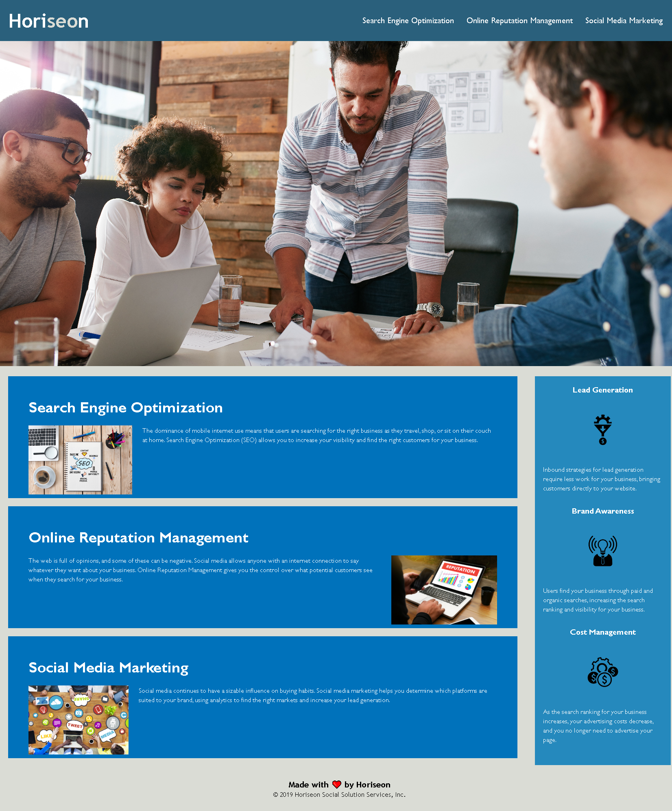

# WEEK 1: Code Refractor Challenge [HTML, CSS, and Git]

## Horiseon Challenge
* In our classes' first week's challenge we prepared ourselves for our first scenario we may encounter as a web developer. We were given the starter code to refractor the Horiseon page to make it more accessible. After organizing 

### Challenge Goals
 * Web Accessibility: Optimize semantic HTML elements that follows a logical structure independant of styling and position with all elements with attributes organized with proper descriptions and positioning.
 * Improve code-base: Along with all the proper elements optimized and organizated, we will also be needing to ensure that the code base is improved for long-term sustainability by checking all links are functioning properly and increasing efficiency of the CSS. We will be including marks within the HTML and CSS code to describe our changes. 
 * Once code base is properly functioning with our improvements we will have to deploy the application to a live URL and Github URL which displays the site with a proper repository.

## Screenshot

## Status
* Starter code has been optimized and organized to reduce the amount of repetition and clutter. (for example: change the numerous div's to navs, reduce unneccessary classes to headers, footers, etc)
* Starter code has been modified to be more accessible. ( for example: added titles, alt attributes)
* Areas of modifications have been labeled within HTML and CSS.
* Completed all acceptance criteria and have deployed links:
    * Live link: https://louyoon89.github.io/Horiseon/
    * Github link: https://github.com/louyoon89/Horiseon
